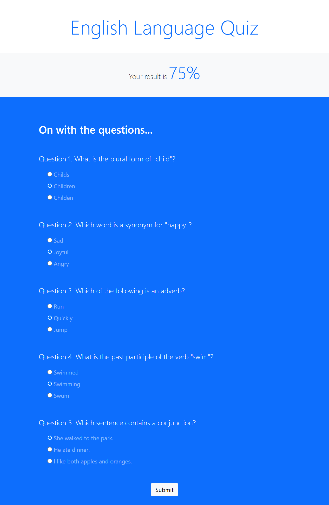

# Net Ninja - Project Interactive Quiz

## Table of contents

- [Overview](#overview)
  - [The challenge](#the-challenge)
  - [Screenshot](#screenshot)
  - [Links](#links)
- [My process](#my-process)
  - [Built with](#built-with)
  - [What I learned](#what-i-learned)
- [Author](#author)
- [Acknowledgments](#acknowledgments)

## Overview

### The challenge

Users should be able to:

- Choose a correct answer to the multiple questions
- See the percentage of the overall score result

### Screenshot

#### Interactive Quiz Desktop Preview

---



#### Interactive Quiz State

---


### Links

- Live Site URL: [Interactive Quiz](https://sdacleofe.github.io/english-language-quiz-js/)

## My process

### Built with

- Semantic HTML5 markup
- Bootstrap
- JavaScript ES6

### What I learned

I learned how to compare the correct answers to the user's answers using arrays, display the result score with the Document Object Model (DOM), utilize properties of the window object, and create an animated score using setInterval() and clearInterval().

```javascript
let output = 0
const timer = setInterval(() => {
  result.querySelector('span').textContent = `${output}%`
  if (output == score) {
    clearInterval(timer)
  } else {
    output++
  }
}, 20)
```

## Author

- Website - [Shanice](https://github.com/sdacleofe/about-me)

## Acknowledgments

I would like to express my gratitude to the Net Ninja for JavaScript course in udemy, which provided me a guidance and insights on how to create this interactive quiz. Thanks to Shaun the instructor of this course for helping me to enhance my skills and making this simple project possible.
